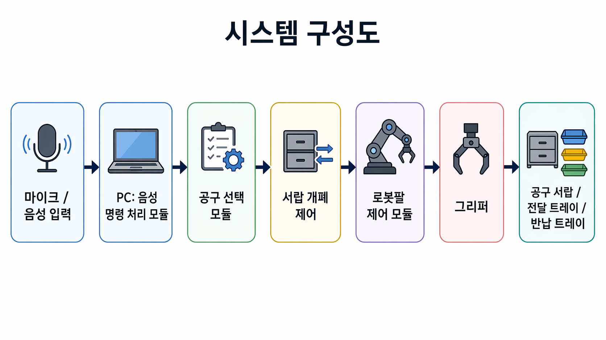

# 로봇팔 프로젝트 | 요구사항 명세서

> 요구사항 명세서
> Software / System Requirements Specification

## 1. 문서 정보

| 프로젝트명 | 음성 명령 기반 공구 서랍 관리 로봇팔 어시스턴트 |
| --- | --- |
| 팀명 | MacGyvBot (맥가이봇) |
| 검토자 | 이민형 |
| 작성일 | 2026. 04. 24. |

## 2. 시스템 개요

### 2.1 시스템 구성

| 로봇팔 모델 | Doosan Robotics m0609 |
| --- | --- |
| 제어 방식 | Python 기반 로봇팔 API 또는 ROS 2 노드 연동, 상위 제어 모듈에서 작업 시퀀스 관리 |
| 엔드이펙터 | 2지 평행 그리퍼 |
| 주요 센서 | 상방 고정형 USB 카메라, 마이크 |
| 보관/전달 장치 | 단일 서랍 또는 모형 서랍, 공구별 지정 위치, 사용자 앞 전달 트레이, 반납 트레이 |
| 개발 언어/환경 | Python 3.10, OpenCV, STT 라이브러리, 로봇팔 제어 API, Ubuntu 22.04 |
| 작업 환경 | 실내 작업대, 조도 일정한 환경, 제한된 공구 3~4종, 공구 무게 200g 이하 |

### 2.2 시스템 구성도

구성 설명: 사용자가 “렌치 가져다줘”와 같이 음성 명령을 입력하면, PC의 음성 명령 처리 모듈이 공구명을 추출한다. 제어 모듈은 서랍을 열고 요청 공구의 사전 좌표 또는 카메라 기반 인식 좌표를 확인한 뒤, 로봇팔과 그리퍼를 제어하여 공구를 사용자에게 직접 전달한다. 사용 후 반납 트레이에 놓인 공구는 원래 서랍 위치로 재정리하고 서랍을 닫는다.

## 3. 기능 요구사항 (Functional Requirements)

| ID | 분류 | 요구사항 내용 | 우선순위 | 담당 |
| --- | --- | --- | --- | --- |
| FR-001 | 음성 입력 | 사용자의 음성 명령을 입력받고 STT 결과 텍스트를 생성한다. | 필수 | 음성/인터페이스 담당 |
| FR-002 | 명령 해석 | STT 결과에서 제한된 공구명(십자드라이버, 일자드라이버, 렌치, 플라이어 등)을 추출한다. | 필수 | 음성/인터페이스 담당 |
| FR-003 | 공구 매칭 | 추출된 공구명에 따라 서랍 내부의 대응 공구 위치 또는 목표 좌표를 선택한다. | 필수 | 로봇팔 제어 담당 |
| FR-004 | 서랍 개폐 | 공구 전달 전 서랍을 열고, 작업 완료 후 서랍을 닫는 동작을 수행한다. | 권장 | 하드웨어 담당 |
| FR-005 | 파지 | 선택된 공구 위치로 로봇팔을 이동시키고 그리퍼로 공구를 안정적으로 파지한다. | 필수 | 로봇팔 제어 담당 |
| FR-006 | 전달 | 파지한 공구를 사용자 앞 고정 전달 트레이로 이동시켜 내려놓는다. | 필수 | 로봇팔 제어 담당 |
| FR-007 | 반납 감지 | 사용자가 반납 트레이에 놓은 공구를 감지하거나 반납 명령을 받아 재정리 작업을 시작한다. | 권장 | 비전/인터페이스 담당 |
| FR-008 | 재정리 | 반납된 공구를 원래 서랍 내 지정 위치로 옮겨 정리한다. | 권장 | 로봇팔 제어 담당 |
| FR-009 | 위치 보정 | 카메라를 이용해 공구의 위치가 약간 틀어진 경우 중심 좌표를 보정한다. | 권장 | 비전 담당 |
| FR-010 | 상태 표시 | 현재 상태(대기, 음성 인식, 서랍 열림, 공구 전달 중, 반납 대기, 오류)를 화면 또는 콘솔에 표시한다. | 권장 | 통합 테스트 담당 |
| FR-011 | 오류 처리 | 요청한 공구가 없거나 파지 실패가 발생하면 작업을 중단하고 사용자에게 오류 상태를 알린다. | 필수 | 통합 테스트 담당 |
| FR-012 | 로깅 | 음성 명령, 요청 공구, 작업 시간, 성공 여부, 실패 원인을 CSV 또는 로그 파일로 저장한다. | 권장 | 통합 테스트 담당 |

## 4. 비기능 요구사항 (Non-Functional Requirements)

| ID | 분류 | 요구사항 내용 | 우선순위 | 담당 |
| --- | --- | --- | --- | --- |
| NFR-01 | 성능 | 음성 명령 입력부터 공구 전달 완료까지 평균 30초 이내에 수행한다. | 필수 | 통합 테스트 담당 |
| NFR-02 | 음성 인식 정확도 | 제한된 명령 문장 기준 공구명 인식 성공률 90% 이상을 달성한다. | 필수 | 음성/인터페이스 담당 |
| NFR-03 | 공구 선택 정확도 | 요청 공구와 실제 선택 공구의 일치율 95% 이상을 유지한다. | 필수 | 비전/제어 담당 |
| NFR-04 | 파지 안정성 | 공구별 20회 반복 테스트에서 파지 성공률 85% 이상을 달성한다. | 필수 | 로봇팔 제어 담당 |
| NFR-05 | 전달 안정성 | 지정 전달 트레이에 공구를 안정적으로 내려놓는 성공률 85% 이상을 달성한다. | 필수 | 로봇팔 제어 담당 |
| NFR-06 | 서랍 개폐 안정성 | 서랍 열기/닫기 각 20회 반복 테스트에서 90% 이상 성공한다. | 권장 | 하드웨어 담당 |
| NFR-07 | 재정리 안정성 | 반납 공구를 원래 위치로 복귀시키는 성공률 80% 이상을 달성한다. | 권장 | 통합 테스트 담당 |
| NFR-08 | 안전 | 로봇팔 동작 중 비상정지 입력 또는 작업 영역 이상 상황 발생 시 즉시 동작을 중단한다. | 필수 | 하드웨어 담당 |
| NFR-09 | 사용성 | 초보자가 안내 문서만 보고 5분 이내 기본 시연을 시작할 수 있어야 한다. | 권장 | 문서화 담당 |
| NFR-10 | 유지보수 | 공구 종류, 서랍 좌표, 전달 트레이 좌표, 반납 트레이 좌표를 설정 파일로 관리한다. | 권장 | 통합 테스트 담당 |

## 5. 제약 사항 (Constraints)

- 하드웨어: 학과 보유 또는 교육용 6축 로봇팔 1대와 소형 그리퍼를 사용한다.
- 공구 종류: 초기 구현 범위는 십자드라이버, 일자드라이버, 렌치, 플라이어 등 3~4종으로 제한한다.
- 보관 환경: 단일 서랍 또는 모형 서랍을 사용하며, 다단 서랍장 전체 관리는 제외한다.
- 전달 방식: 안전을 위해 사용자의 손에 직접 쥐여주는 것이 아니라 사용자 앞 고정 전달 트레이에 내려놓는다.
- 반납 방식: 사용자는 공구를 반납 트레이에 놓고, 로봇팔은 해당 위치에서만 공구를 회수한다.
- 안전/법규: 실험실 안전 수칙을 준수하며, 전달 회수 작업 외 로봇팔 작업 반경 내 인체 진입을 제한한다.
- 작업 조건: 조도가 일정한 실내 환경에서 테스트하며, 공구가 심하게 겹쳐 있거나 가려진 상황은 제외한다.
- 시간: 6주 내 완료를 목표로 하며 1~3단계를 필수 구현, 4단계 이후는 권장/확장 목표로 관리한다.

## 6. 추가 재료 목록

| No. | 분류 | 품목명 | 수량 | 단가(원) | 합계(원) | 링크 |
| --- | --- | --- | --- | --- | --- | --- |
| 1 | 시연 | 투리파이 실속형 가정용 공구세트 공구 16종 1세트 | 1 | 11,320 | 11,320 | [https://www.coupang.com/vp/products/7650690586?itemId=20355642254&vendorItemId=91583047201&q=%EA%B3%B5%EA%B5%AC&searchId=5e3c1b001208662&sourceType=search&itemsCount=60&searchRank=17&rank=17&traceId=mocnl44z](https://www.coupang.com/vp/products/7650690586?itemId=20355642254&vendorItemId=91583047201&q=%EA%B3%B5%EA%B5%AC&searchId=5e3c1b001208662&sourceType=search&itemsCount=60&searchRank=17&rank=17&traceId=mocnl44z) |
| 총 계 |  |  |  |  | 11,320 |  |

## 7. 단계별 구현 범위와 요구사항 매핑

| 단계 | 구현 목표 | 관련 요구사항 | 구현 우선순위 |
| --- | --- | --- | --- |
| 1단계 | 지정 위치의 공구를 집어 전달 위치로 이동 | FR-005 | 필수 |
| 2단계 | 공구 종류별 다른 위치에서 가져오기 | FR-003, FR-005 | 필수 |
| 3단계 | 사용 후 공구 재정리 | FR-005, FR-007, FR-009 | 필수 |
| 4단계 | 서랍 개폐 및 공구 파지 | FR-004, FR-005, FR-008, FR-009 | 권장 |
| 5단계 | 음성 명령으로 공구 선택 | FR-001, FR-002, FR-003 | 권장 |
| 6단계 | 사용자 손 방향으로 공구 전달 | FR-006, FR-007 | 선택 |
